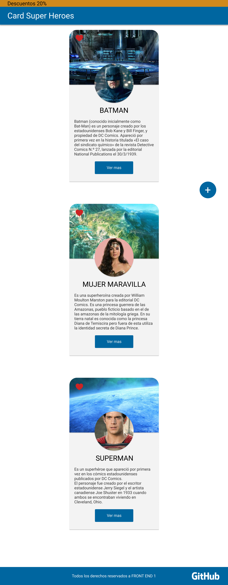
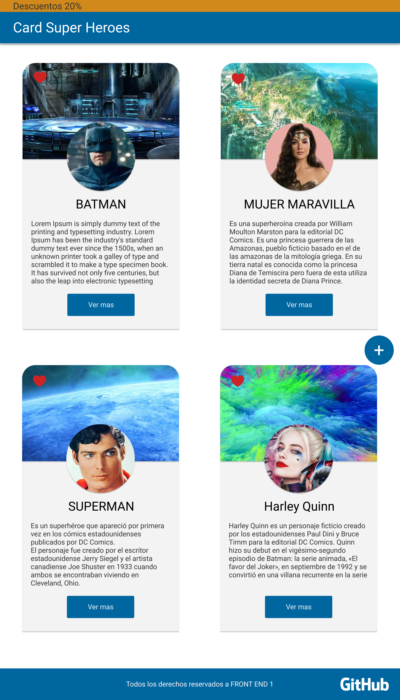

# Práctica C10S - Frontend I

## Diseño adaptativo (*Responsive Web Design*)

Se solicita crear el maquetado con los conocimientos adquiridos hasta el momento y aplicando los conceptos de diseño adaptativo visto en clase.

El objetivo es desarrollar una recreación lo más cercana posible a los siguientes diseños:
  

**Version mobile (smartphones)**

  

**Version tablets**

  
